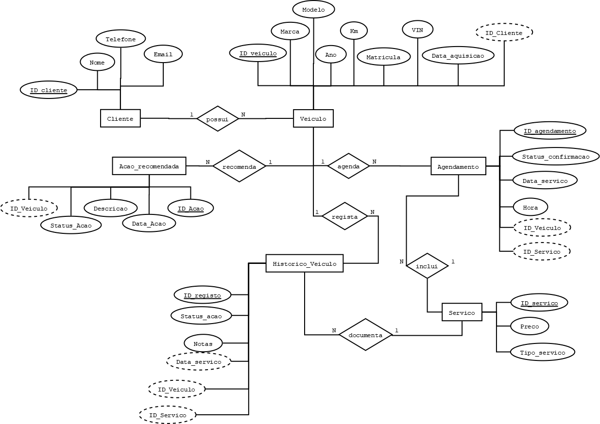

# Esquema Conceptual

## Introdução

> Modelo Entidade-Associação do sistema de gestão de oficina mecânica. [*desenvolvido com DiaPortable*]

---

## Entidades e Associações

### Cliente
A entidade **Cliente** representa os indivíduos que contratam os serviços da oficina. Cada cliente possui um identificador único (`ID`) e é caracterizado por atributos como `Nome`, `Telefone` e `Email`. Um cliente pode possuir vários veículos.

### Veículo
A entidade **Veículo** representa os automóveis registados na oficina. Os atributos incluem `ID`, `Marca`, `Modelo`, `Ano`, `Km`, `Matrícula` e `VIN`. Cada veículo pertence exclusivamente a um cliente.

### Serviço
A entidade **Serviço** define os tipos de serviços que a oficina oferece. Cada serviço tem um `ID`, uma descrição do `Tipo de Serviço` e um `Preço` associado. Esta entidade é usada como referência nas agendamentos e no histórico de serviços realizados.

### Agendamento
A entidade **Agendamento** representa a marcação de um serviço para um determinado veículo. Inclui `ID`, `Data do Agendamento`, `Hora`, `Status de Confirmação` e a associação com o veículo e o tipo de serviço. Cada agendamento está ligado a apenas um veículo e refere-se a um único tipo de serviço.

### Histórico
Esta entidade regista os serviços realizados em cada veículo. Contém os atributos `ID do Registo`, `Data do Serviço`, `Notas sobre o Serviço` e `Status da Ação` (concluída ou pendente). Está associada ao veículo e ao serviço realizado.

### Ação Recomendada
A entidade **Ação Recomendada** contém informações sobre futuras intervenções a realizar num veículo. Cada ação inclui `ID`, `Descrição`, `Data da Ação` e `Status`. Está associada diretamente a um veículo e pode surgir na sequência de um serviço.

---

## Regras de Negócio Adicionais (Restrições)

As seguintes regras de negócio foram identificadas como necessárias à integridade do sistema, mas não são diretamente representáveis no modelo E/A:

- Um veículo não pode ter mais do que um serviço agendado na mesma data e hora.
- Não é permitido eliminar registos de histórico de serviços – o histórico deve ser permanente.
- As ações recomendadas devem estar sempre associadas a um veículo e conter uma descrição e um estado (pendente ou concluída).
- Cada serviço realizado deve constar obrigatoriamente no histórico de veículo.
- Um agendamento só pode existir se houver um veículo associado previamente registado.
- O status de confirmação de um agendamento deve ser atualizado antes da data do serviço.

---

| [< Previous](REBD01.md) | [^ Main](../../README.md) | [Next >](REI03.md) |
|:----------------------------------:|:----------------------------------:|:----------------------------------:|
