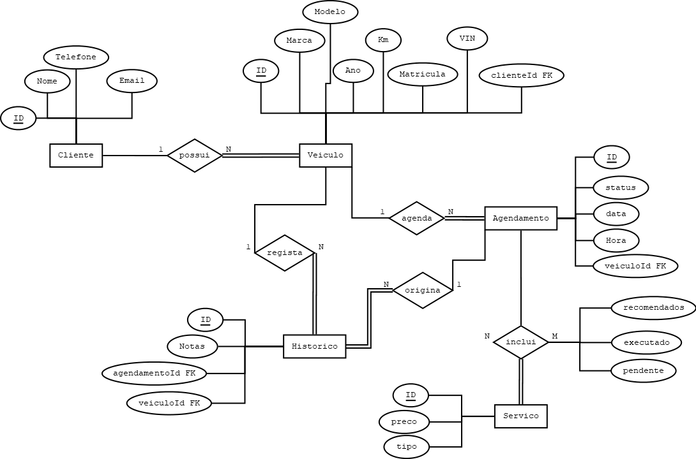

# C2 : Esquema Conceptual

## Introdução

> Modelo Entidade-Associação do sistema de gestão de oficina mecânica. [*desenvolvido com DiaPortable*]

---

## Entidades

### Cliente
A entidade **Cliente** representa os indivíduos que contratam os serviços da oficina. Cada cliente possui um identificador único (`id`) e é caracterizado pelos atributos:
- `nome`
- `telefone`
- `email`

Cada cliente pode possuir vários veículos, mas cada veículo pertence apenas a um cliente.

### Veiculo
A entidade **Veiculo** representa os automóveis registados na oficina. Os seus atributos são:
- `id`
- `matricula`
- `marca`
- `modelo`
- `ano`
- `km`
- `vin`
- `clienteId` (chave estrangeira que referencia a entidade Cliente)

Cada veículo está associado a exatamente um cliente e pode ser objeto de vários agendamentos e registos no histórico.

### Servico
A entidade **Servico** define os serviços que a oficina disponibiliza aos seus clientes. Os atributos incluem:
- `id`
- `tipo` (descrição do serviço)
- `preco`

Os serviços são associados aos agendamentos através da entidade associativa `Inclui`.

### Agendamento
A entidade **Agendamento** representa a marcação de serviços para um determinado veículo. Contém os atributos:
- `id`
- `data`
- `hora`
- `status`
- `veiculoId` (chave estrangeira referencia o veículo a que o agendamento pertence)

Cada agendamento refere-se a um veículo específico e pode incluir múltiplos serviços. Pode ainda dar origem a registos no histórico.

### Historico
A entidade **Historico** regista as ações realizadas sobre um veículo, com base num agendamento. Os atributos são:
- `id`
- `notas`
- `agendamentoId` (chave estrangeira referencia o agendamento associado)
- `veiculoId` (chave estrangeira referencia o veículo em questão)

Está ligado tanto ao `veículo` como ao `agendamento` que o originou.

### Inclui
A entidade associativa **Inclui** liga `Agendamento` e `Serviço` numa relação **N:M**. Possui os seguintes atributos:
- `agendamentoId` (chave estrangeira referencia o agendamento)
- `servicoId` (chave estrangeira referencia o serviço)
- `recomendado`
- `executado`
- `pendente`

Estes atributos permitem saber o estado de cada serviço associado a um agendamento.

---

## Associações

### possui (Cliente - Veiculo)
- Descrição: Cada cliente pode possuir vários veículos, mas cada veículo está associado a apenas um cliente (via FK `clienteId`).
- Cardinalidade: **1:N**

### agenda (Veiculo - Agendamento)
- Descrição: Um veículo pode ter vários agendamentos associados. Cada agendamento refere-se a apenas um veículo (via FK `veiculoId`).
- Cardinalidade: **1:N**

### inclui (Agendamento - Servico)
- Descrição: Representa uma associação N:M entre agendamentos e serviços. É uma entidade associativa com atributos descritivos (`recomendado`, `executado`, `pendente`) que indicam o estado do serviço.
- Cardinalidade: **N:M** (implementada com FK `agendamentoId` e `servicoId`)

### origina (Agendamento - Historico)
- Descrição: Um agendamento pode originar vários registos no histórico. Cada registo histórico refere-se a um único agendamento (via FK `agendamentoId`).
- Cardinalidade: **1:N**

### regista (Veiculo - Historico)
- Descrição: Um veículo pode ter múltiplos registos no histórico. Cada registo está associado a um único veículo (via FK `veiculoId`).
- Cardinalidade: **1:N**

---

## Regras de Negócio Adicionais (Restrições)

As seguintes regras de negócio foram identificadas como necessárias à integridade do sistema, mas não são diretamente representáveis no modelo E/A:

- Imutabilidade do Histórico: Não é permitido eliminar registos da entidade `Historico`, uma vez que estes constituem evidência das intervenções realizadas. Apenas agendamentos podem ser apagados.

- Dependência de Agendamento em relação a Veículo: Um agendamento só pode ser criado se existir previamente um veículo associado.

- Estado obrigatório do Agendamento: O campo `status` do agendamento deve ser sempre definido (ex: "Confirmado", "Cancelado", "Pendente"). A atualização do estado é obrigatória em cada modificação relevante (ex: após execução do serviço).

- Associação a Serviços: Cada agendamento deve incluir pelo menos um serviço na entidade associativa `Inclui`, salvo se for posteriormente cancelado.

- Serviços com Estado Exclusivo: Os atributos `recomendado`, `executado` e `pendente` da entidade `Inclui` devem ser mutuamente exclusivos por lógica de transição de estados — por exemplo, um serviço não pode ser simultaneamente pendente e executado.

- Clientes com pelo menos um Veículo: Embora opcional no modelo inicial, espera-se na prática que cada cliente possua pelo menos um veículo. A aplicação pode aplicar esta validação conforme o contexto.

---

| [< Previous](RPF01.md) | [^ Main](../../README.md) | [Next >](RPF03.md) |
|:----------------------------------:|:----------------------------------:|:----------------------------------:|
