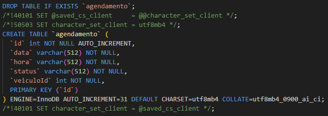

# C7 : LoopBack Migrate vs SQL Original

---

# Diferenças Identificadas

Durante o desenvolvimento, foram encontradas várias diferenças entre a estrutura gerada automaticamente pelo comando `migrate()` do LoopBack e o script SQL escrito manualmente.

### Tipos de Dados ENUM

- Na API, o campo `status` (Agendamento) foi definido como `ENUM` para validação e restrição de valores na lógica da aplicação. `ENUM('Pendente', 'Confirmado', 'Cancelado')`
- No entanto, ao executar `migrate()`, o LoopBack cria essas colunas ignorando a restrição de domínio.

### Tamanho dos Campos

- No modelo LoopBack, muitos campos foram definidos apenas como `string` sem tamanho máximo.
- Devido a falta de controlo de tamanho o LoopBack converte automaticamente para `VARCHAR(512)`, ao passo que no SQL original foram definidos tamanhos específicos (ex: `VARCHAR(100)` para nome, `VARCHAR(15)` para telefone).

---

## Prints de exemplo

| SQL print | Loopback Migrate Print |
|-------|-------|
|  |  |

---

| [< Previous](RPF06.md) | [^ Main](../../README.md) | [Next >](RPF08.md) |
|:----------------------------------:|:----------------------------------:|:----------------------------------:|
