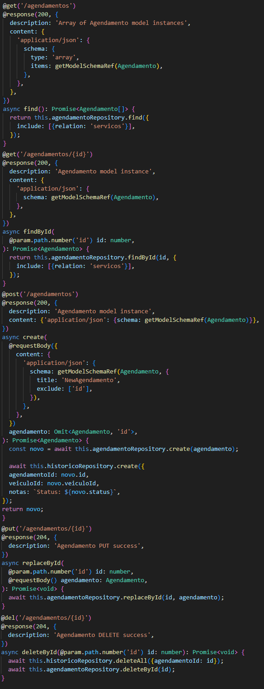
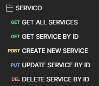
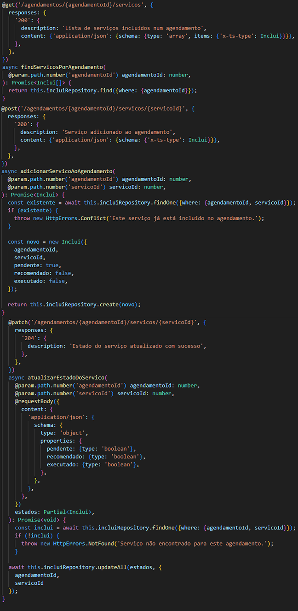

# C8 : Organização e Justificação da Coleção Postman

---

## Estratégia Geral

A coleção foi organizada por entidades (`CLIENTES`, `VEICULOS`, `AGENDAMENTO`, `SERVICOS`, `INCLUI`, `HISTORICO`) e cada conjunto de endpoints reflete tanto as necessidades práticas da API como o comportamento esperado dos utilizadores finais (administração e mecânicos).

> **Nota:** Todos os métodos não utilizados foram deliberadamente omitidos da coleção, tendo sido apenas implementados os que respondem aos objetivos funcionais e à lógica do domínio da oficina.

---

- [CLIENTES](#CLIENTES)
- [VEICULOS](#VEICULOS)
- [AGENDAMENTOS](#AGENDAMENTOS)
- [SERVICOS](#SERVICOS)
- [INCLUI](#INCLUI)
- [HISTORICO](#HISTORICO)

---

## Justificação de Decisões por Entidade

### CLIENTES
- Inclui todos os métodos CRUD: `GET`, `POST`, `PUT`, `DELETE`.
- Justificação: os dados do cliente são geridos diretamente pela equipa administrativa.

<strong>CLIENTES – Ver print dos endpoints</strong>

| Print Clientes | Print Controller |
|-------|-------|
|  |  |

---

### VEICULOS
| Endpoint | Justificação |
|----------|--------------|
| `GET /veiculos` | Consulta geral. |
| `GET /veiculos/:id` | Consulta específica de um veículo. |
| `GET /clientes/:id/veiculos` ou com `filter` | Obtenção de veículos por cliente. |
| `POST`, `PUT`, `DELETE` | Incluídos porque os veículos são registados, editados ou removidos diretamente por admins.

<strong>VEICULOS – Ver print dos endpoints</strong>

| Print Veiculos | Print Controller |
|-------|-------|
|  |  |

---

### AGENDAMENTOS
- Inclui `GET`, `POST`, `PUT`, `DELETE`.
- Justificação: a marcação de agendamentos é dinâmica, e as alterações/cancelamentos podem ser feitas manualmente.

<strong>AGENDAMENTOS – Ver print dos endpoints</strong>

| Print Agendamentos | Print Controller |
|-------|-------|
|  |  |

---

### SERVICOS
| Método | Justificação |
|--------|--------------|
| `GET`  | Consulta geral. |
| `GET /servicos/:id` | Consulta individual para detalhes de um serviço. |
| `POST`, `PUT` | Incluídos porque os serviços podem ser adicionados e atualizados conforme a oficina expande ou diversifica os seus serviços. |
| `DELETE` | Incluído para permitir testes e gestão completa dos serviços, embora na prática os serviços raramente sejam removidos. |

<strong>SERVICOS – Ver print dos endpoints</strong>

| Print Servicos | Print Controller |
|-------|-------|
|  |  |

---

### INCLUI (Agendamento + Serviço)
| Método | Justificação |
|--------|--------------|
| `GET`  | Visualizar serviços associados a um agendamento. |
| `POST` | Associar novos serviços a um agendamento. |
| `PATCH`| Necessário para atualizar os estados `pendente`, `executado`, `recomendado` — **única entidade com `PATCH` porque contém estados dinâmicos por registo**. |

> **Nota:** Não foi incluído `DELETE` porque os serviços não devem ser removidos após associados — seguem lógica funcional do domínio da oficina.

<strong>INCLUI – Ver print dos endpoints</strong>

| Print Inclui | Print Controller |
|-------|-------|
|  |  |

---

### HISTORICO
- Apenas possui `GET`.
- Justificação:
  - **Não é editável nem criado manualmente**.
  - É gerado automaticamente com base em ações no `AgendamentoController`.
  - Serve apenas como log de leitura.

<strong>HISTORICO – Ver print dos endpoints</strong>

| Print Historico | Print Controller |
|-------|-------|
|  |  |

---

## Critérios para Inclusão/Omissão de Métodos HTTP

| Método | Usado em | Justificação |
|--------|----------|--------------|
| `GET`  | Todas as entidades | Essencial para leitura de dados. |
| `POST` | Entidades criadas pelo utilizador | Apenas onde faz sentido o input direto. |
| `PUT`  | Entidades editáveis como Clientes, Servicos, Veiculos e Agendamentos | Gestão administrativa. |
| `PATCH`| Apenas `Inclui` | Editar partes específicas (estados). |
| `DELETE`| Só onde há uma permissão lógica para remoção definitiva | Excluído de `Inclui` e `Historico` por integridade funcional. |

---

| [< Previous](RPF07.md) | [^ Main](../../README.md) |
|:----------------------------------:|:----------------------------------:|
